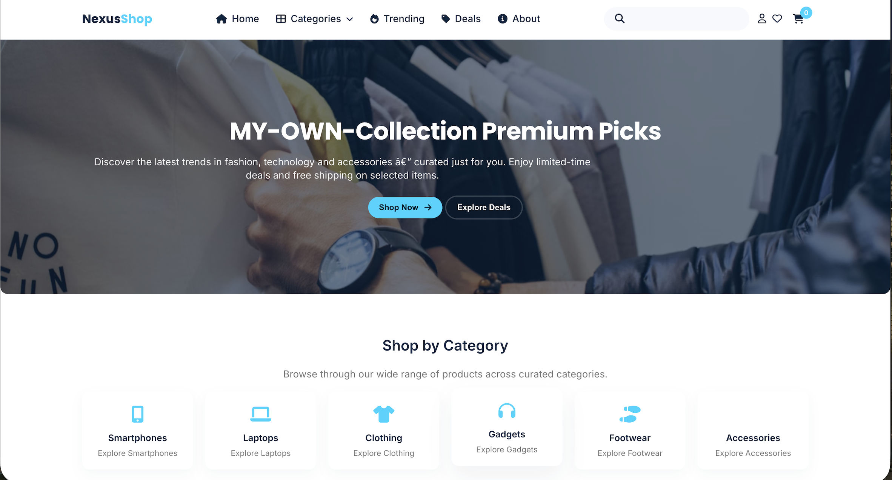
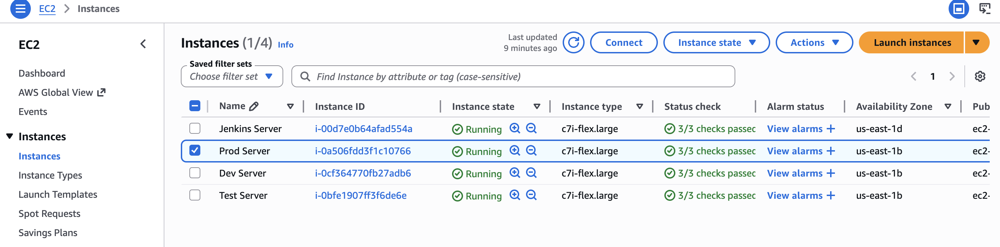
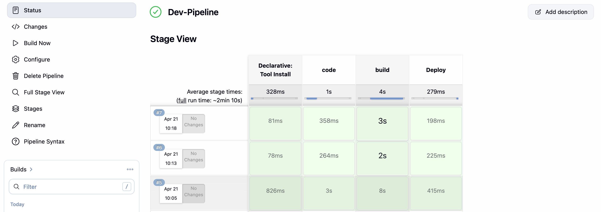
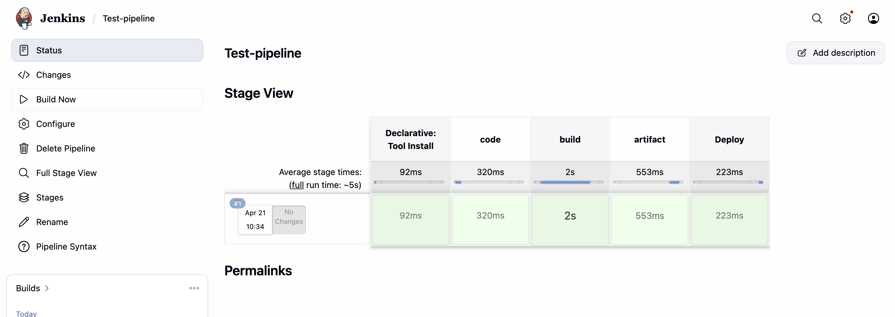
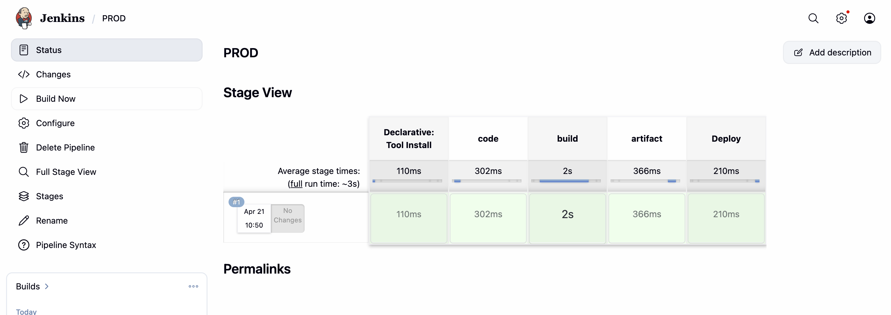
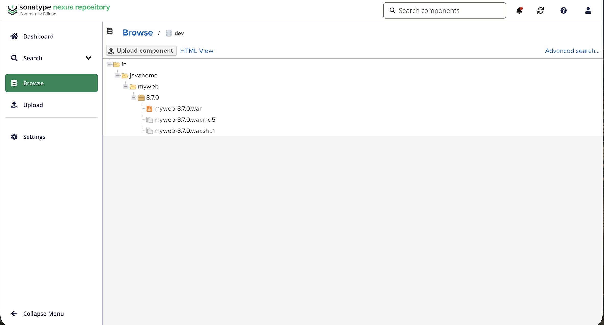
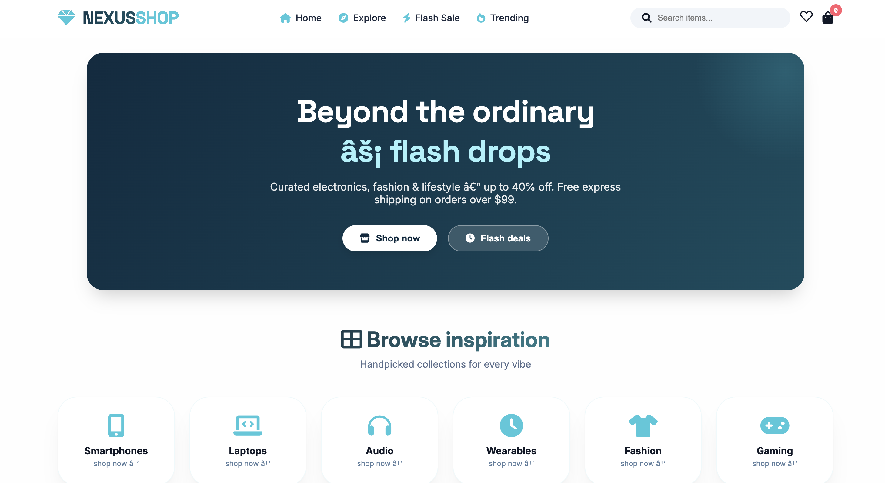

# CI/CD & Git Workflow

This doc covers two things: the Git branching strategy we follow, and the Jenkins pipeline that ships code from a dev's laptop to production.

We follow Git Flow. It keeps `main` stable, `develop` as the working branch, and uses short-lived feature, release, and hotfix branches for everything else. The CI/CD pipeline is designed around this branching model — though full automation is still a work in progress. For now, the structure and process below are what the team follows manually, so the handoff to automation later is painless.


## 1. Branch overview

```
main
 └── develop
       └── feature/your-feature-name
             └── release/v1.0.0
                   └── (merge to main)

main
 └── hotfix/critical-bug-fix
       └── (merge back to main + develop)
```


## 2. Branches

### main

Production code. Whatever is on `main` is what real users are running. Nobody commits here directly — code only lands via a merge from a `release/*` or `hotfix/*` branch.

### develop

Taken from `main`. This is the team's working branch — feature branches are cut from here, and finished features merge back here. Think of it as what the next release will look like.

### feature/*

Cut from `develop`, merged back to `develop`.

Anytime someone builds something new, they branch off `develop`. Name it after the feature:

```
feature/user-authentication
feature/payment-gateway
feature/dashboard-redesign
```

Build it, test it locally, raise a PR back to `develop`. Reviewer approves, merge, done.

### release/*

Cut from `develop`, merged to `main` (and back into `develop` after).

When `develop` has everything planned for the next release and the team is confident, we cut a release branch. That branch goes to QA.

- If QA passes, release branch merges to `main` — it's live.
- If QA finds bugs, they go back to the dev team, fixes land on the release branch, QA re-runs.

After merging to `main`, pull `main` back into `develop` so they don't drift.

Naming:

```
release/v1.0.0
release/v1.2.0
```

### hotfix/*

Cut from `main`, merged to `main` and `develop`.

When something breaks in production, we branch off `main` directly — not `develop`, because `develop` has unfinished work we don't want to ship. Fix the bug, test, merge into `main` to unblock production, then also merge into `develop` so the fix isn't lost on the next release.

Naming:

```
hotfix/fix-payment-crash
hotfix/fix-login-token-expiry
```


## 3. Full flow

```
main ──────────────────────────────────── (stable production)
 │
 └──► develop ──────────────────────── (replica of main)
          │
          └──► feature/xyz ──────────── (new feature work)
                   │
                   └──► develop ──────── (feature merged back)
                            │
                            └──► release/v1.0.0
                                      │
                            ┌─────────┴──────────┐
                            │                    │
                        Tests Pass           Tests Fail
                            │                    │
                       merge to main        back to devs
                            │                    │
                       main (live)        fix → re-release
                            │
                       pull latest main into develop

── If production breaks ──

main ──► hotfix/critical-fix ──► merge to main
                                      │
                              merge to develop
```


## 4. CI/CD — Jenkins setup

**Current prod UI**



We use Jenkins with one master and four slave nodes. Each environment gets its own dedicated server so nothing leaks across environments.



| Environment | Server setup                   | Slave label |
| ----------- | ------------------------------ | ----------- |
| Dev         | Tomcat                         | `dev`       |
| Test        | Tomcat + Nexus                 | `test`      |
| UAT        | Tomcat + Nexus                 | `uat`       |
| Prod        | Tomcat + Nexus                 | `prod`      |

Each slave is registered in Jenkins with its label. Pipelines pick the right node based on the label, so a test job never accidentally runs on the prod box.


## 5. Pipelines per environment

### Dev

Triggered by: `develop` branch. Runs on node `dev`.

```
Checkout (develop)
   │
   ▼
Build (compile + package)
   │
   ▼
Unit tests
   │
   ▼
Deploy to Dev Tomcat
   │
   ▼
Dev team verifies the app is up, endpoints work, ports are open
   │
   ▼
If good → create release/* branch
```



No Nexus here, no manual approval. Dev is meant to be fast and cheap.

### Test

Triggered by: `release/*` branch. Runs on node `test`.

Two things are different from Dev — we publish the build to Nexus, and there's a manual approval gate before anything actually deploys.

```
Checkout (release/*)
   │
   ▼
Build
   │
   ▼
Publish artifact to Nexus
   │
   ▼
Automated tests
   │
   ▼
⏸ Manual approval — "Deploy to Test?" → manager approves
   │
   ▼
Deploy to Test Tomcat (pull artifact from Nexus)
   │
   ▼
QA tests
   │
 ┌─┴─┐
Pass  Fail
 │     │
 ▼     ▼
UAT   Bugs go back to dev → fix on release branch → re-run
```



The approval step matters. Nothing deploys without a human saying yes.

### UAT

Triggered by: `release/*` branch. Runs on node `uat`.

Same shape as Test. The difference is who's validating — business or client instead of QA. If UAT signs off, release merges into `main`. If not, it goes back to dev.

```
Checkout (release/*)
   │
   ▼
Build + push to Nexus
   │
   ▼
⏸ Manual approval
   │
   ▼
Deploy to UAT Tomcat
   │
   ▼
Business / client validates
   │
 ┌─┴─┐
Pass  Fail
 │     │
 ▼     ▼
Merge  Back to dev
release → main
```

### Prod

Triggered by: `main` branch. Runs on node `prod`.

Same pipeline shape — build, artifact, approve, deploy. This one's just pointed at the prod box.

```
Checkout (main)
   │
   ▼
Build + push to Nexus
   │
   ▼
⏸ Final approval
   │
   ▼
Deploy to Prod Tomcat
   │
   ▼
Live
```



**Nexus**



**Update UI on current production**




## 6. End-to-end

```
Developer pushes code
   │
   ▼
Jenkins picks the pipeline based on the branch
   │
   ├── develop   → node: dev   → build, test, deploy
   │                 │
   │                 ▼
   │               Dev OK → create release/*
   │                 │
   │                 ▼
   │               node: test  → build, Nexus, approve, deploy
   │                 │
   │                 ▼
   │               QA OK → same release/*
   │                 │
   │                 ▼
   │               node: uat   → build, Nexus, approve, deploy
   │                 │
   │                 ▼
   │               UAT OK → merge release/* to main
   │                 │
   │                 ▼
   └── main      → node: prod  → build, Nexus, approve, deploy
```


## 7. Pipeline stages

Every pipeline follows the same six stages. Not all apply to every environment:

| Stage    | What it does                                     | Where it runs      |
| -------- | ------------------------------------------------ | ------------------ |
| Checkout | Pull code from the right branch                  | All                |
| Build    | Compile and package (`.war` / `.jar`)            | All                |
| Test     | Unit / integration tests                         | All                |
| Artifact | Push build to Nexus                              | Test, UAT, Prod    |
| Approval | Manual gate — a human clicks approve             | Test, UAT, Prod    |
| Deploy   | Deploy to the env's Tomcat                       | All                |
